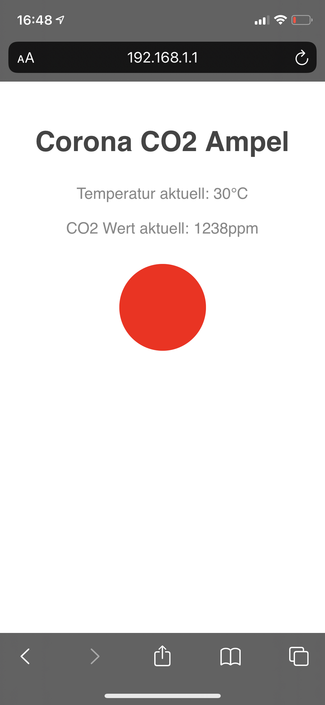

    
     
     
    <h1>CO2 Ampel</h1>
    

        Create your own CO2 Light to fight against Covid-19
    

## How it works
The project is based on a Wemos D1 mini and a MH-Z19B CO2 sensor.\
The MH-Z19B sensor will give us in a certain interval CO2 gas values and temperature (default every 10 sec).\
One WS2812B Pixel LED will show the air quality based on the recommended values by [Bundesumweltamt Germany](https://www.umweltbundesamt.de/sites/default/files/medien/pdfs/kohlendioxid_2008.pdf)
- 300-700ppm *Green*
- 700-1000ppm Yellow
- 1000-2000ppm Red
- 2000 and above blinking Red

| Values (ppm) | Color |
|--------------|--------|
| 300-700 | green | 
| 700-1000| yellow|
| 1000-2000| red|
| >2000|blinking red|

The board and anything else will be powered by an old micro usb power supply.

### Simple Version
This version will only indicates the values as already shown above via the LED light.
### Access Point Version
The Access Point Version will creates an access point where you can connect with any wifi device.

| Settings |   |
|--------------|--------|
| SSID | CO2Ampel | 
| Password | Covid-19 |

After that you can open 192.168.1.1 with any browser. You will see your Temperature, CO2 gas value and a green, yellow or red circle.

        

## What you need
- Wemos D1 Mini (may work with other ESP8266 Devices too)
- MH-Z19B CO2 Sensor
- WS2812B LED
- Jumper Wires
- Micro USB Power Supply

## How to install
Clone this repository to your computer or copy the code for the [Simple Version](https://github.com/tekkiebros/co2ampel/tree/main/CO2_ampel_simple) or [Access Point Version](https://github.com/tekkiebros/co2ampel/tree/main/CO2_ampel_AP)

